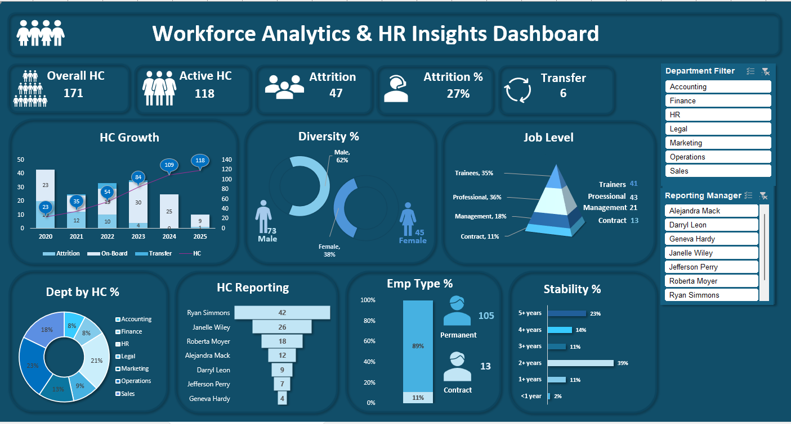

# 📊 Workforce Analytics & HR Insights Dashboard

## 🔹 Overview
This project presents an interactive Excel dashboard designed to analyze workforce structure, attrition trends, employee stability, and distribution across departments and job levels.

---

## 🔹 Problem Statement
High employee attrition and low workforce stability can impact organizational performance. This dashboard helps identify patterns and areas of concern for HR decision-making.

---

## 🔹 Key Features
- KPI Cards: Overall HC, Active HC, Attrition %, Transfers  
- Workforce Growth Trend (HC vs Onboard vs Attrition)  
- Gender Diversity Analysis  
- Job Level Distribution  
- Department-wise HC%  
- Employee Stability Analysis  
- Interactive Slicers (Department, Reporting Manager)

---

## 🔹 Tools Used
- Microsoft Excel  
- Pivot Tables  
- Slicers  
- Data Cleaning & Transformation  

---

## 🔹 Key Insights
- Attrition rate at **27%** indicates significant retention challenges  
- Workforce is concentrated in **junior roles (trainees & professionals)**  
- Employee stability is relatively low, suggesting early exits  

---

## 🔹 Files Included
- Workforce Analytics & HR Insights Dashboard.xlsx  
- Dashboard.png  

---

## 🔹 Dashboard Preview

